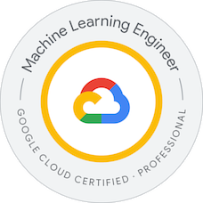

<h1>Google Cloud Certified Professional Machine Learning Engineer - Preparation Guide</h1>

[Google Cloud Certified Professional Machine Learning Engineer](https://cloud.google.com/learn/certification/machine-learning-engineer)

## Table of Contents
* [Official Resources](#official-resources)
* [Preparation Process and Tips](#preparation-process-and-tips)
    * [Navigating Through the Learning Path](#navigating-thorugh-the-learning-path)
* [Exam Pattern and Analysis](#exam-pattern-and-analysis)
    * [Question Types and Scoring](#questions-types-and-scoring)
    * [Example Question Scenarios](#example-question-scenarios)
* [External Resources](#external-resources)
* [Exam Readiness and Procedure](#exam-readiness-and-procedure)

## Official Resources
* Cloud Skills Boost - **Self Learning** - [Learning Path](https://partner.cloudskillsboost.google/paths/84)
* Partner Certification Academy - **Partner Training**
    - [Training Schedule](https://rsvp.withgoogle.com/events/partner-learning/partner-certification-academy)
    - [Recommended Path](https://services.google.com/fh/files/events/beta-pmle-ca.pdf)
* Official PMLE **Study Guide** 
    - [Amazon](https://amzn.in/d/5bo6kNo)
    - [Oreilly Learning](#https://learning.oreilly.com/library/view/official-google-cloud/9781119944461/) - Free with Publicis Account
* Sample **Questionnaire** - [Google Forms](https://docs.google.com/forms/d/e/1FAIpQLSeYmkCANE81qSBqLW0g2X7RoskBX9yGYQu-m1TtsjMvHabGqg/viewform)
* Official **Exam Guide & Syllabus** - [Certification Page](https://cloud.google.com/learn/certification/guides/machine-learning-engineer)
* Cloud Skills Boost - Self Learning - [Learning Path (Old)](https://www.cloudskillsboost.google/paths/17)

## Preparation Process and Tips
1. Start with the foundations. If you are just starting the ML journey, start by going over the ML Basics and make sure you have a solid understanding of the relevant topics (SQL and databases included).
2. Go through the [Official Certification page](https://cloud.google.com/learn/certification/machine-learning-engineer) in detail. Understand the exam pattern and the key areas that it will cover. 
    > For an official overview of the Certification, watch this video on [Cloud On Air Events](https://cloudonair.withgoogle.com/events/machine-learning-certification). It is a bit old but still provides reasonable insights into the exam.
3. Then enroll yourself in either the [Partner Training](#official-resources) or the Cloud Skills Boost [PMLE Learning Path](#official-resources). Cover at least one of these two thoroughly to get a good basic understanding of how Machine Learning solutions are built on Google Cloud.
4. Make yourself familiar with the core Google Cloud ML services. Follow through the labs (especially in sections like MLOps, Production Systems etc.) and pay attention to the best practices being followed in those. The exam focuses a lot on best practices.
5. After establishing some basic knowledge, start reading the Official Study Guide. This book is very thorough with the concepts being covered in the Exam. It is the <i>best resource</i> available for practice. The questions really test and help reinforce your understanding from the base. 
    > It is free on Oreilly Learning or can be bought on Amazon. It has more than 200 practice questions and grants access to 100 Questions in it's online testbank.
6. As indicated in the [syllabus](#official-syllabus) and [analysis](#exam-pattern-and-analysis), during your preparation put emphasis on understanding how ML Solutions are architectured on Google Cloud. 
    > Vertex AI, Pretrained APIs, Auto ML, Dataflow, Tensorflow Extended, Kubeflow, Vertex AI Experiments, Hyperparameter Tuning, Model Serving, BigQuery ML etc., are a few areas that should be given some extra time to understand.
7. Signup for the [digital resources](#http://www.wiley.com/go/sybextestprep) provided by the book and test yourself on the 100 extra questions provided. Each response selection(right or wrong) comes with its own explanation. These help clarify and strengthen your grasp on these topics. 
8. In addition to the questions, from the digital resources, you also get access to 200+ flashcards to help quickly revise all the simple concepts. Revise these the day/night before the exam to jog your memory.
9. Practice the questions from the official [Sample Questionnaire](#official-resources) and refer to the explanations and documentation links provided along with each question.
10. As a final round round of revision, go through the details provided in the tables and figures from the [Study Guide](#official-resources) and the summary notes provided at the end of each module in the [Cloud Skills Boost Learning Path](https://partner.cloudskillsboost.google/paths/84).

### Navigating thorugh the Learning Path
The learning path provided on Cloud Skills Boost (Google cloud's official learning platform) is a great starting point for the preparation of this exam. However, given the duration and number of videos and labs available under this, it is understandable that not all the courses in it offer the same value.

Here is a list of courses/modules (not exhaustive) that I think add the most value to your preparation:
- Launching into Machine Learning
- Introduction to Tensorflow
- Feature Engineering
- Machine Learning on the Enterprise
- Production Machine Learning Systems
- Machine Learning Operations (MLOps)
- ML Pipelines on Google Cloud

Additionally, in a few other courses, there is content available on the use of Pretrained APIs. Going over that is also crucial for the exam.

## External Resources
The official resources should ideally be sufficient for the preparation, but in case anyone wants to, they can refer to the following list of additional resources.
* Online Course - Preparing for PMLE Course - [Coursera](https://www.coursera.org/professional-certificates/preparing-for-google-cloud-machine-learning-engineer-professional-certificate)
* Preparation Guide - Rolf Siegel - [Medium](https://www.linkedin.com/pulse/how-study-pass-googles-professional-machine-learning-engineer-siegel/) - 2021
* Preparation Guide - Sathish vj - [Medium](https://sathishvj.medium.com/notes-from-my-google-cloud-professional-machine-learning-engineer-certification-exam-2110998db0f5)
* Preparation Guide - sathishvj - [Github](https://github.com/sathishvj/awesome-gcp-certifications/blob/master/professional-machine-learning-engineer.md)
* Preparation Guide - Radhakrishna B - [Medium](https://www.linkedin.com/pulse/how-study-pass-googles-professional-machine-learning-engineer-siegel/)
* Online Course - PMLE Certification Prep - [Udemy](https://www.udemy.com/course/google-cloud-machine-learning-engineer-certification-prep/)

## Exam Pattern and Analysis

As shown in the image above, the exam focuses on these 6 umbrella topics. Details of each are listed in the [Official Syllabus](#official-syllabus) section below.

### Questions Types and Scoring
- Multiple Choice Questions: Single and Multi Correct. Multi-correct questions will be rewarded only if all correct responses are selected. No questions will be asked on code.
- Only Pass or Fail status will be notified initially. Final marks scored will not be displayed. However, you will be able to download your score report if you do not pass the exam.

### Example Question Scenarios
Below are a few important example scenarios around which the questions may be focused around in the exam. These help in getting an overview of the final questions.
1. **Pre-processing**: 
- In the case of company xyz, the data streamed is high-dimensional, what is the best way to select features for model training?
- How to pre-process and store data in the best way to facilitate subsequent steps in the workflow?
- Data handling techniques to improve efficiency and accuracy. Outliers, Categorical, high dimensional or imbalanced data.
- Datasource contains PII or other sensitive data, what is the best way to handle it? 
- Choose between Cloud DLP vs Cloud Healthcare API vs other pre-built AI solutions.
2. **Pipeline Choice**: 
- Given two pipeline frameworks, like Kubeflow or Vertex AI Pipelines(TFX), which one suits the best to the current problem?
- Choose a framework among Dataflow, Dataproc, Airflow, Cloud Composer etc., under certain conditions.
- Usage of specific components and connectors in frameworks like Kubeflow, TFX, Dataflow, Dataproc etc.
3. **Constraint-Situations**: Under constraints like time, cost, development effort, infra overhead, management overhead etc., What is the best solution to implement?
4. **Fact-based questions**: (Rare) Testing the knowledge around capabilities of existing Pretrained APIs or AI enterprise solutions.
5. **ML Solution Comparison**: 
- Given a certain problem, which is the best ML solution to adopt among Pretrained APIs, Auto ML, Custom Models?
- Questions on concepts like Transfer Learning, Federated Learning, Edge device deployment etc.
- How to design a ML solution for a problem following the best practices?
- Interoperability between various pipelines and frameworks and domains. Understanding of data transfer procedures and solutions.
6. **Model Design & Accuracy**: 
- An ML model you trained was doing fine is development, not so much in production? Why? How to resolve it? 
- Model loss is not converging during training, what can be done?
- Choose between solutions like L1, L2 Regularization, Dropout Regularization etc. for problems like overfitting and model stability.
- How to select the metrics for training? Which one is most appropriate for a given case?
7. **Distributed Training & Scaling**: 
- Which compute engine instance is suitable (or not) for this scenario?
- In a certain situation, which is best accelerator to use, if any? (CPU vs GPU vs TPU)
- A huge model is taking a lot of time to train, with certain constraints which training strategy should be adopted?
- Accelerators like GPU, TPU are not meant to be used in which cases?
- Model is trained on-premises, how to best utilise Google cloud's ML services for scaling?
8. **Serving Solution**: 
- An existing solution is facing certain problems during serving (like latency, accuracy), how to best fix them?
- How to improve the prediction time in certain cases, like edge deployment, mobile devices etc?
- Model portability between Vertex AI, BigQuery ML, Edge Devices and so on. Differential Privacy & Federated Learning.
9. **MLOps & Retraining**: 
- How to stitch the CI/CD/CT practices with the Google Cloud services in a best way.  
- What is the best approach to maintain model reliability with a retraining framework?
10. **Monitoring**:  
- How should the infrastructure and model performance be monitored during training?
- Which monitoring method is best to save cost/detect drift/store data etc?
11. **Explainability**: 
- In certain industries like Banking/Healthcare, model explainability is very important, which explainability or interpretability metrics is the best for your ML solution?
- For the given situation, select the best monitoring method between Sampled Shapley, Integrated gradients & XRAI?
12. **BigQuery ML**: 
- Datasource is XYZ, is it best to go with BigQuery ML or Vertex AI for model training? 
- What pipeline configurations should be used for the end-to-end flow when using BigQuery ML?

## Exam Readiness and Procedure
1. For professionals who have taken the partner training, to earn the <i>auto-provisioned voucher</i>, complete the mandatory labs mentioned in the <em>[Recommend Path](#official-resources)</em> first.
2. Repeat the steps from [Preparation Tips](#preparation-process-and-tips) until you are confident about having an end-to-end understanding of the exam topics.
3. Register and Schedule for the exam atleast one week prior to the planned date. Visit the official [certification page](#google-cloud-certified-professional-machine-learning-engineer---preparation-guide) for the latest registration guidelines.
4. In case you have registered for the remote proctored exam, Have a personal laptop that meets the basic requirements to take the exam and make sure to complete the following steps beforehand.
    - Download the Lockdown Browser.
    - Complete the Biometric Profile registration.
5. Have a light dinner, a good night's sleep and do not wake up too early or too late on the exam day.
6. Any breaks or consumables (even water) will not be allowed during the exam, so make sure to clear all your requirements beforehand.
7. If remote proctored, the link to launch your exam will appear on the 'My Assessments' page 10mins before the scheduled exam time. 
8. Upon clicking the launch buttom, the Lockdown Broswer will automatically open and all other apps on your laptop will be shutdown. 
9. An online proctor will be assigned and you will be asked to clear <i>everything</i> from your table. 
10. Capture and upload pictures of your exam environment. Once verified and approved, your exam will start momentarily.
11. Stay calm and relaxed during the exam. All The Best!

Author: Arfath Ahmed Syed 
Last Updated On: 28/04/2024